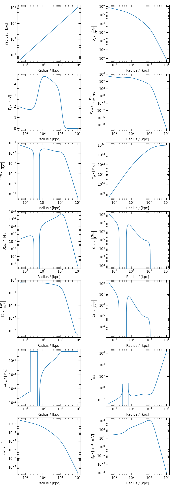
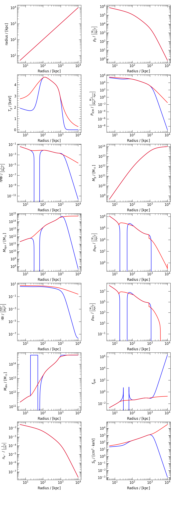

.. _cluster_collections:

Cluster Collections
===================

Cluster Generator is designed to provide easy, end-to-end support for generating initial conditions for simulation; however,
sometimes it may be of interest to generate initial conditions which provide a model of a known system which has been
constrained observationally. In general, to do so requires the user to determine the properties of the system from literature.
Fortunately, Cluster Generator provides an ever growing library of available cluster models taken directly from the
literature in the form of its :py:mod:`cluster_generator.cluster_collections` module.

.. rubric:: Available Cluster Collections

.. py:currentmodule:: cluster_collections

.. autosummary::
    :template: class.rst

    Vikhlinin06
    Ascasibar07
    Sanderson10

What is A Collection?
---------------------

Cluster Generator's collections module is driven by a core class, the :py:class:`cluster_generator.cluster_collections.Collection`, which provides all
of the backend facilities for reading the datasets from file. Each cluster collection available in the package by default is provided
with its own class, for example the :py:class:`cluster_generator.cluster_collections.Vikhlinin06` class. Each collection contains a number of galaxy cluster parameters
and the corresponding analytical profiles which they were fit too.

Using Collections
-----------------

Let's briefly go through the steps of initializing Abell 133 from the Vikhlinin06 collection. First off, import the collections module as
follows:

.. code-block:: python

    >>> from cluster_generator.cluster_collections import Vikhlinin06
    >>> collection = Vikhlinin06()

We can see the available galaxy clusters by using

.. code-block:: python

    >>> print(collection.clusters)
    {'A133': <__main__.ProtoCluster object at 0x7f7d7e302890>,
     'A262': <__main__.ProtoCluster object at 0x7f7d7e8fbdd0>,
     'A383': <__main__.ProtoCluster object at 0x7f7d7dd17e10>,
     'A478': <__main__.ProtoCluster object at 0x7f7d7dd4df90>,
     'A907': <__main__.ProtoCluster object at 0x7f7d7dd49c10>,
     'A1413': <__main__.ProtoCluster object at 0x7f7d7dd49dd0>,
     'A1795': <__main__.ProtoCluster object at 0x7f7d7dd48590>,
     'A1991': <__main__.ProtoCluster object at 0x7f7d7e33d410>,
     'A2029': <__main__.ProtoCluster object at 0x7f7d7dba9810>,
     'A2390': <__main__.ProtoCluster object at 0x7f7d7dbaa090>,
     'RXJ 1159+5531': <__main__.ProtoCluster object at 0x7f7d7dbaaa90>,
     'MKW 4': <__main__.ProtoCluster object at 0x7f7d7dbab490>,
     'USG CS152': <__main__.ProtoCluster object at 0x7f7d7dbab750>}

Notice that each item in the system is a :py:class:`cluster_generator.cluster_collections.ProtoCluster` instance. These are a lot like the :py:class:`cluster_generator.model.ClusterModel` instances
except that they aren't quite initialized yet. The most important thing about these objects is that they have the special :py:meth:`cluster_generator.cluster_collections.ProtoCluster.load` method
which works as follows:

.. code-block:: python

    >>> h = vik.clusters["A133"].load(5, 10000)
    >>> print(h)
    cluster_generator : [INFO     ] 2023-11-01 08:59:37,344 Computing the profiles from density and temperature.
    cluster_generator : [INFO     ] 2023-11-01 08:59:37,492 Integrating gravitational potential profile.
    cluster_generator : [WARNING  ] 2023-11-01 08:59:39,067 Detected 1 warnings during integration. Non-Physical regions may be present in your profiles.
    <cluster_generator.model.ClusterModel object at 0x7fab7769b390>

Notice that the :py:meth:`cluster_generator.cluster_collections.ProtoCluster.load` instance converts the :py:class:`cluster_generator.cluster_collections.ProtoCluster` instance into a fully realized :py:class:`cluster_generator.model.ClusterModel` instance!
Unfortunately, we aren't quite done. See that warning in the returned values? Let's take a look at what we actually managed to generate and see what's going on.

.. code-block:: python

    import matplotlib.pyplot as plt
    from cluster_generator.cluster_collections import Vikhlinin06

    collection = Vikhlinin06()

    model = collection.clusters["A133"].load(5,10000)

    model.panel_plot(gs_kwargs={"wspace":0.4})
    plt.show()

.. admonition:: Sidebar: Why Does it Look So Bad!?

    Generally speaking, observational studies consider some observable range of a cluster (say :math:`[r_0,r_1]`) on which they
    can obtain data. They then construct a profile function (say :math:`T(r)` or :math:`\rho_g(r)`) which can successfully fit
    the available data, but they don't consider whether or not those profiles are actually self-consistent. This means that
    outside of the observed regime, there's no guarantee that the profile has any representative truth.

Because this issue is a relatively generic happening, the :py:mod:`cluster_generator.correction` module was created to manage non-physical regions
in galaxy cluster models including this one. Let's try the above code again but this time with an NPR correction:

.. code-block:: python

    import matplotlib.pyplot as plt
    from cluster_generator.cluster_collections import Vikhlinin06
    from correction import NonPhysicalRegion

    collection = Vikhlinin06()

    model = collection.clusters["A133"].load(5,10000)

    model = NonPhysicalRegion.correct(model, recursive=True)
    model.panel_plot()
    plt.show()

.. admonition:: Sidebar: Why so Bumpy??

    The automated corrections system (:py:mod:`cluster_generator.cluster_generator.correction`) is one of the most complex aspects of the entire Cluster Generator
    code base. Because these non-physical regions are difficult to identify, categorize, and systematically correct, some numerical
    residuals do occasionally persist after corrections have been made. In this case, the correction algorithm in use provides
    a recomputed temperature profile in :math:`C^1[a,b]`; however, any system which required a derivative of the temperature profile
    would have seen rapid changes in slope.

Now that the non-physical issues are corrected, we can go ahead and put these systems to work in whatever way we desire!
